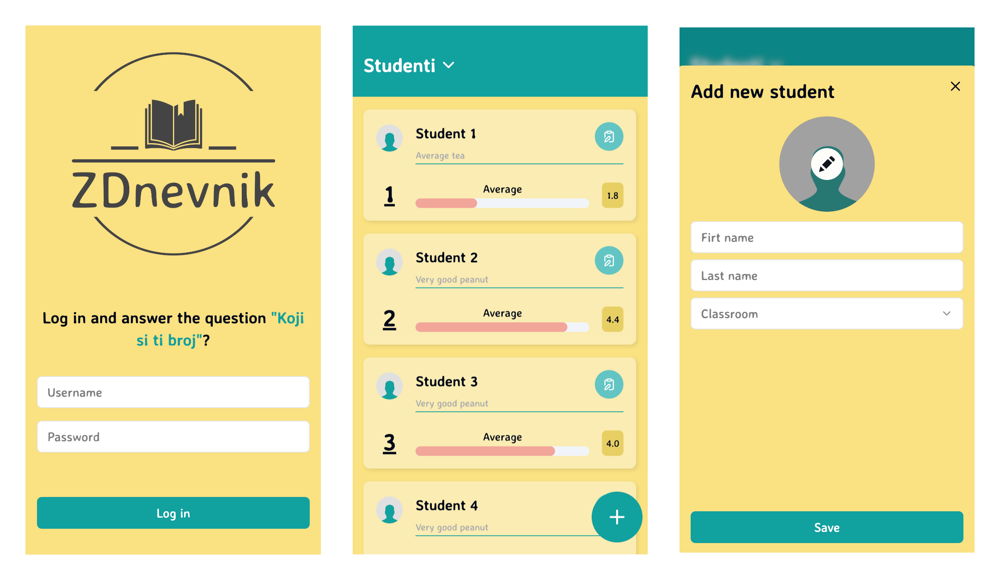

<p align="center">
  <a href="https://zdnevnik.com/">
    
    <h1 align="center">ZDnevnik</h1>
  </a>
</p>

<p align="center">
  
</p>

# Introduction

ZDnevnik is a mobile-first web app (it hasn't been optimized for desktop yet) for teachers and students. It allows you to manage your classes and students.

It is a hobby project and my intention for it is to be used by my nephews and nieces. Because, jokingly, I am grading them for absurd things (like if they bring me a glass of water when I ask them to or similar shenanigans).

# Project structure

This is a monorepo with the following projects:

- [`apps/api`](./apps/api/README.md): RESTful API made with [Node](https://nodejs.org/en) using [Fastify](https://fastify.dev/) as the framework
- [`apps/sveltastic`](./apps/sveltastic/README.md): Web app made with [SvelteKit](https://kit.svelte.dev/)
- [`libs/toolkit`](./libs/toolkit/README.md): Common/shared tools and libraries for the projects

# Getting started

### Prerequisites

This project requires a few tools in order to run it. Those tools are:

- [Node v20.10.0](https://nodejs.org) - or you can use [nvm](https://github.com/nvm-sh/nvm) to install the correct Node version by running `nvm use`
- [pnpm v9.7.0](https://pnpm.io/)
- [Docker](https://www.docker.com) and [Docker Compose](https://docs.docker.com/compose/install/)

Then you also need to set up the ENV variables for the web app and API.

- [API instructions](./apps/api/README.md#environment-variables)
- [Web app instructions](./apps/sveltastic/README.md#environment-variables)

You also need to update your `/etc/hosts` file with the following entry:

```
127.0.0.1       zdnevnik.local api.zdnevnik.local
```

### Running the app

To run the app, use the following commands:

```sh
docker compose up -d # This will run the api, db, web and reverse proxy services
```

After successfully building and running docker compose, you should be able to access the web app at `http://zdnevnik.local`.